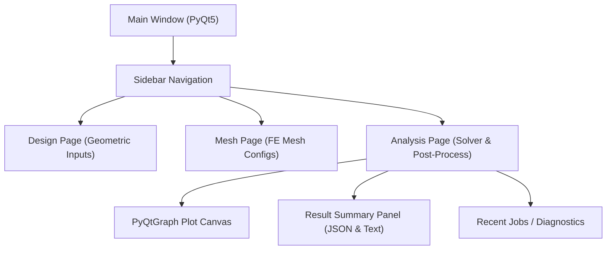

# HELIX / SCLAS GUI 개발 및 기능 통합 보고서

**작성일**: 2026-06-15  
**대상**: HELIX / SCLAS 프로젝트 프론트엔드 개발 및 관리 부서  
**작성자**: Antigravity AI 어시스턴트

---

## 1. 개요 및 GUI 아키텍처
HELIX / SCLAS 해저 케이블 구조 해석 시스템의 GUI는 **PyQt5**를 기반으로 개발되었으며, 복잡한 유한요소 해석(FEA) 백엔드 입력 설정과 결과 데이터 시각화를 엔지니어에게 직관적으로 제공하는 것을 목적으로 합니다. 

엔지니어링 소프트웨어의 표준 워크플로우에 따라 화면은 크게 **Design(설계) ➔ Mesh(격자) ➔ Analysis(해석 및 사후 처리)**의 3단계로 구조화되어 있습니다.



---

## 2. 주요 구현 및 완료 기능

### 2.1. UI/UX 및 반응형 레이아웃 설계
* **스크롤 안심 컨테이너 (Scroll-safe Layouts)**: 소형 모니터(표준 최소 해상도 1366x768) 환경에서 텍스트 및 입력 컴포넌트가 잘려 보이는 현상(Clipping)을 차단하기 위해 모든 위젯 그룹에 수직/수평 스크롤 바 래퍼가 구현되었습니다.
* **사용자 조절형 분할창 (Resizable Splitters)**: 좌측의 수치 입력 패널과 우측의 플롯/시각화 영역 사이를 수평 resizable splitter로 나누어, 분석 화면 크기를 동적으로 최적화할 수 있도록 지원합니다.
* **접이식 패널 (Collapsible Sections)**: 해석 제어 영역의 물리 옵션들을 필요에 따라 아코디언 형태로 접고 펼칠 수 있도록 레이아웃 공간 효율성을 제고했습니다.

### 2.2. 다국어(영어/한국어) 런타임 토글 시스템
* 전역 상태로 `self.ui_language`를 관리하며, 언어 토글 시 화면 재로딩 없이 즉시 텍스트가 전환되는 구조입니다.
* 라벨, 버튼, 툴팁뿐만 아니라 **아바쿠스 경고 가이드라인 및 결과 요약**까지 완벽하게 동적 번역을 지원합니다.

### 2.3. 데이터 파이프라인 및 백엔드 바인딩
* **GUI ➔ 백엔드 송신**: 화면의 입력 컴포넌트(스핀박스, 콤보박스 등) 값들을 백엔드 아바쿠스 러너가 해석할 수 있는 `input_data.json` 및 `abaqus_mesh_manifest.json` 포맷의 데이터 계약 형태로 즉시 직렬화(Serialize)하여 패키징합니다.
* **백엔드 ➔ GUI 수신 (이력 관리)**: 
  * 해석이 완료된 결과 폴더의 `result_data.csv` 및 `result_summary.json` 파일을 역직렬화(Deserialize)하여 화면에 바인딩합니다.
  * **Recent Jobs 패널**을 통해 과거에 실행했던 모든 해석 이력 폴더들을 비동기식으로 리스트업하고, 더블클릭 시 과거 데이터 곡선을 즉각 복원해 냅니다.

### 2.4. 고성능 시각화 (PyQtGraph 차트)
* **Moment-Curvature Hysteresis Loop**: 대용량 절점 데이터를 지연(Lag) 없이 부드럽게 렌더링하기 위해 PyQtGraph를 채택했으며, 기본 휠 줌 및 마우스 드래그를 지원합니다.
* **Focus Plot 모드**: 차트를 더 넓게 볼 수 있도록 입력 패널들을 토글 처리로 숨기는 기능을 지원합니다.
* **CSV 다중 비교 (Overlay)**: 현재 열려있는 그래프 위에 외부 CSV 결과 파일을 직접 불러와 오버레이하여 문헌 데이터나 실험 데이터와의 차이를 눈으로 직접 비교할 수 있습니다.
* **내보내기 액션 (Export Actions)**: 결과 화면을 고해상도 이미지(PNG) 또는 CSV 형태의 텍스트 파일로 파일 시스템에 즉시 익스포트할 수 있습니다.

### 2.5. 프론트엔드 진단 및 피드백 UI (Diagnostics Integration)
* **오프라인 진단 (Diagnose selected)**: 아바쿠스 라이선스 미달, 수렴 에러 등 해석 오류 발생 시 최근 작업 목록에서 해당 폴더를 선택하고 진단 버튼을 누르면 아바쿠스 로그(`.dat`, `.msg`)를 파싱하여 해결 가이드라인과 블로킹 이슈를 텍스트 패널 최상단에 바로 띄워줍니다.
* **캘리브레이션 결과 실시간 연동 (방금 적용)**:
  * 캘리브레이션 템플릿 모듈이 도출한 분석값(탄성 강성, 슬립 강성, 이력 에너지 손실, 고착-미끄러짐 전이 곡률)이 있을 경우, 이를 결과 요약 패널 하단에 실시간으로 출력하도록 연동되었습니다.

---

## 3. 프론트엔드 개발자 참고 (코드 설계 구조)
프론트엔드 소스코드([sclas_remote_gui.py](file:///Users/parkjiho/Desktop/코덱스저장소/01_SCLAS_케이블해석/code/sclas_remote_gui.py))는 컴포넌트의 가독성과 유지보수성을 극대화하기 위해 다음과 같은 클래스 구조로 정렬되어 있습니다.

```python
class SCLASRemoteGUI(QMainWindow):
    def __init__(self):
        # 1. UI 및 테마(HELIX 브랜드 애셋) 초기화
        # 2. 레이아웃 (Splitter, ScrollArea, Sidebar) 수립
        # 3. 데이터 및 플롯 캔버스 생성
        # 4. 시그널/슬롯 바인딩 및 파일 감시자 실행

    def init_ui(self):
        # Design, Mesh, Analysis 각 탭별 프론트엔드 위젯 배치

    def format_summary(self, data: dict) -> str:
        # JSON 요약 데이터를 다국어(KO/EN) 문자열 템플릿으로 변환하여
        # 화면의 요약 패널(QPlainTextEdit)에 출력하는 포매터

    def update_plots(self):
        # PyQtGraph 캔버스 위에 현재 데이터와 다중 비교 대상 CSV를 플로팅
```

---

## 4. 향후 확장 추천 방향성 (프론트엔드 관점)
* **3D 실시간 케이블 형상 렌더링**: PyQt의 PyOpenGL이나 Q3DSurface를 도입하여, 사용자가 Design 탭에서 입력한 아머 수(Lay count)와 두께에 따라 3D 형상 메쉬 프리뷰를 직관적으로 회전/확대해볼 수 있는 3D 뷰어 컴포넌트 추가.
* **실시간 실해석 수렴 진행률 그래프 (STA Monitoring)**: 아바쿠스 해석 시 생성되는 `.sta` 파일을 실시간으로 읽어와(tailing), 현재의 하중 증분(time increment) 진행 단계를 프로그레스 바나 작은 그래프로 실시간 업데이트해 주는 모니터링 컴포넌트 설계.
