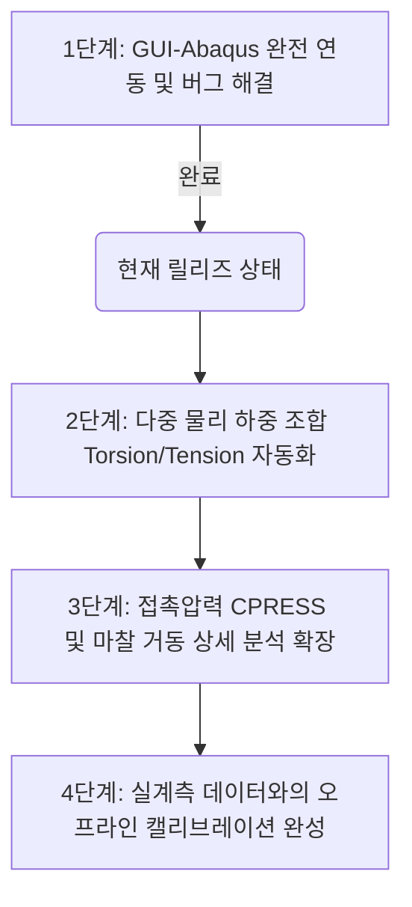

# 2026-07-10 Mesh count/size 입력 피드백 반영

* 보광/팀 피드백 캡처 기준으로 Mesh Setting Guide에 `Mesh input basis`를 추가했습니다.
  * `Division count`: 기존처럼 `n_z`, `n_theta`, `n_r` 개수를 직접 입력합니다.
  * `Target size`: 목표 mesh size(mm)를 입력하면 GUI가 내부에서 division count로 환산합니다.
* backend 호환성을 위해 `input_data.json`에는 항상 기존 count key를 유지합니다.
  * `mesh.axial_divisions`
  * `mesh.core_circumferential_divisions`
  * `mesh.armour_circumferential_divisions`
  * `mesh.inner_sheath_radial_divisions`
  * `mesh.bedding_radial_divisions`
  * `mesh.outer_sheath_radial_divisions`
* size mode에서 입력한 원래 목표 크기는 `mesh.target_sizes_mm`와 `mesh_controls.target_sizes_mm`에 같이 저장합니다.
* 원주방향 division은 4의 배수를 **강제하지 않고**, 데모/설명용 권장사항으로만 기록합니다.
  * `mesh.circumferential_division_policy.multiples_of_4_recommended_for_demo = true`
  * `mesh.circumferential_division_policy.multiples_of_4_enforced = false`
* mesh method 관련 피드백은 정책 metadata로 기록했습니다.
  * 일반 solid: `medial_axis`
  * armour: `front_or_medial_axis_pending_backend_confirmation`
  * 실제 Abaqus mesh method 강제 여부는 backend/보광 확인 후 확정합니다.
* `docs/guides/SCLAS_GUI_VARIABLE_CLEANUP_AND_CODE_MAP_KR.md`의 변수표도 count/size 입력 방식에 맞춰 업데이트했습니다.

---
# 2026-07-09 GUI 변수 정리 / 코드 구조 지도 추가

* 새 문서: `docs/guides/SCLAS_GUI_VARIABLE_CLEANUP_AND_CODE_MAP_KR.md`
* 보광이 피드백 기준으로 GUI 값을 `User Input`, `Derived`, `Fixed / Backend Default`, `Output`으로 나누어 정리했습니다.
* 각 입력값이 어느 탭/섹션에 있고, 코드 key와 JSON path가 무엇인지 회의용 표로 정리했습니다.
* `code/sclas_remote_gui.py`, `code/sclas_backend_gui_bridge.py`, `code/abaqus_runner.py`의 주요 함수 위치와 값 흐름을 설명했습니다.
* 다음 cleanup 후보는 `Abaqus element type` combo 축소/고정, future analysis 변수 숨김, Derived Pitch/Length 표시 방식 조정입니다.

---
# 2026-07-09 Menard-Cartraud pitch/period 프론트 자동화

* 사용자가 첨부한 Marine Structures 논문(Menard and Cartraud, 2023)의 4.2절 Eq. (2)-(4)를 확인했습니다.
* GUI는 이제 helix pitch angle 입력값으로 raw pitch length를 계산합니다.
  * Eq. (2): `p = 2*pi*R_h/tan(alpha)`
* GUI는 여러 helical layer의 공통 period를 Eq. (3) 형태로 자동 선택합니다.
  * Eq. (3): `l = k_j*p_j/n_j`
  * core period `core_pitch_length_mm / core_count`를 기준 `L_eff`로 사용합니다.
* inner/outer armour의 integer multiplier `k`는 `round(L_eff*n_armour/p_raw)`로 자동 선택합니다.
* Design 탭의 `Derived Pitch / Period` 박스는 raw pitch, 선택된 `L_eff`, backend에 넘길 period-matched armour pitch/angle, raw-period error를 표시합니다.
* `input_data.json`에는 `armour.pitch_period_design`, raw pitch, period multiplier, backend preferred pitch key(`armour.inner_armour_backend_pitch_length_mm` 등)를 함께 기록합니다.
* `code/abaqus_runner.py`는 새 period-matched pitch key를 우선 사용하고, 기존 pitch key fallback도 유지합니다.

---
# 2026-07-09 GUI-Backend 정보 교환 계약 확립

* 새 계약 문서: `docs/guides/SCLAS_GUI_BACKEND_EXCHANGE_CONTRACT_KR.md`
* 전체 흐름을 `GUI 입력 -> input_data.json -> Abaqus backend -> result_data.csv/result_summary.json/ODB -> GUI 표시`로 고정했습니다.
* Design 탭에 `core_count` 입력을 추가했습니다. 기본값은 `3`이며 현재 backend 기본 3-core 모델과 맞춥니다.
* 사용자는 core/inner armour/outer armour helix pitch angle을 입력하고, GUI가 pitch length를 계산합니다.
* `analysis_conditions.effective_length_mm`은 더 이상 수동 입력값이 아니라 `core_pitch_length_mm / core_count`로 자동 계산되는 표시값입니다.
* Mesh 탭의 z-direction 분할은 `mesh.axial_divisions` 하나로 통일했습니다. `mesh.filler_z_divisions`는 구버전 호환 key로만 남기고 `same_as_axial_divisions`를 명시합니다.
* `input_data.json`에 `backend_exchange_contract`를 추가해 GUI가 쓰는 파일, backend가 처리해야 하는 순서, GUI가 읽는 결과 파일을 함께 기록합니다.
* `code/sclas_remote_gui.py`, `code/sclas_backend_gui_bridge.py`, `code/abaqus_runner.py`가 새 계약을 읽고 보존하도록 수정되었습니다.

---
# 2026-07-09 GUI 입력 변수 및 Analysis 탭 단순화

* `SCLAS_변수_정리.xlsx` 기준으로 사용자 입력값과 backend 내부/default 값을 다시 분리했습니다.
* Mesh/FEA Setting 탭의 `Abaqus element type`은 `C3D8R` 고정 표시로 바꾸고 `C3D4`, `B31` 선택지를 화면에서 제거했습니다.
* Analysis Results 탭은 실행/JSON/결과 확인 중심으로 단순화했습니다.
  * 화면 표시 입력: `Effective length`, `Loading cycles`, `Result points`
  * 숨김 backend default: `twist`, `axial_strain`, `radial_compression`, residual contact pressure, solver increment values
* `Research Scope / Local Behavior` 체크박스 묶음은 일반 화면에서 숨겼고, payload에는 현재 구현 범위인 bending/pressure 중심 scope만 남깁니다.
* Backend mode는 `FAST GUI preview`, `Export job package only`, `Run local/shared-folder command`만 표시합니다. SSH/scp 원격 설정은 코드 호환용으로 남기되 화면에서는 숨겼습니다.
* Run Controls에 `Import Backend JSON` 버튼을 추가해 기존 `input_data.json`을 GUI 값으로 다시 불러오는 정보 교환 루프를 명확히 했습니다.
* 관련 문서 `docs/guides/SCLAS_GUI_VARIABLE_CLEANUP_AND_CODE_MAP_KR.md`도 같은 내용으로 업데이트했습니다.

---
# CURRENT_HANDOFF_KR (현재 인수인계 및 개발 현황)

최종 갱신일: 2026-07-08 KST

## 2026-07-08 GUI 설계/메시 탭 정리

* **Design 탭 피드백 반영**:
  * 상단 import 영역은 `Import key,value CSV`만 남기고 backend JSON/preset 버튼은 제거했습니다.
  * 기존 `Digital Twin`/2D-3D toggle 표현을 제거하고, 2D 전용 `Section Preview`와 단순 `Layer Legend` 중심으로 정리했습니다.
  * 사이드바 탭명은 `Design`, `Finite Element Analysis Setting`, `Analysis Results`로 단순화했습니다.
  * 우측 상단 `Model`, `Result`, `Local project` 상태 표시는 화면에서 제거했습니다. 내부 상태 라벨은 기존 실행 흐름 보호를 위해 숨김 상태로 유지합니다.
  * `Core Package`는 `Core Section`, `Helix Lay`는 `Helix Pitch Angle`로 변경했습니다.
  * 사용자 입력에서 `core center radius`, `clearance gap`은 제거 상태를 유지하고, 아머-아머 사이 `Bedding thickness` 입력을 사용합니다.
* **Material table 정리**:
  * 컬럼은 `Layer`, `Material`, `Young's modulus E (GPa)`, `Poisson's ratio ν`, `Density ρ (kg/m^3)` 순서입니다.
  * 기존 category 컬럼은 제거했습니다.
  * material 행은 회의 피드백 기준 8행(`Conductor-Copper`, `Insulation-XLPE`, `Core Shield-HDPE`, `Filler-PP`, `Inner Sheath-HDPE`, `Armour-Steel`, `Bedding-PFR`, `Outer Sheath-HDPE`)으로 정리했습니다.
  * inner/outer armour는 별도 material 행으로 쪼개지 않고 `Armour` 한 행을 공유합니다. Abaqus runner도 고정 row index가 아니라 layer/material 이름/alias로 물성을 찾도록 수정했습니다.
* **Mesh 탭 방향 전환**:
  * strategy/armour model은 화면에서 제거하고 backend 기본값을 full 3D segment + solid wire로 고정했습니다.
  * 기존 mesh readiness / generate-preview 흐름은 제거했습니다.
  * Mesh 탭은 z/theta/r division, 외압/곡률/endpoint loading, contact/friction 조건을 설명하는 guide 그림 중심으로 발전시켰습니다.
  * `Finite Element Analysis Setting` 탭 상단에 `Analysis Structure Setup` 영역을 추가하여 외압 하중, 목표 곡률, 마찰계수 입력칸을 배치했습니다. 이 값들은 기존 backend `analysis_conditions` payload와 같은 위젯을 사용합니다.
  * mesh setting label은 `n_z`, `n_θ`, `n_r` rich-text 아래첨자 표기로 복구했고, guide header의 `Top`/`Iso`/`Reset` 카메라 버튼은 제거했습니다.
  * `α_core`, `α_ia`, `α_oa`, `κ`, `μ`, `ν`, `ρ`는 영문 단어가 아니라 그리스 문자로 표시되며, 아래첨자 크기를 키워 고해상도 Windows 화면에서도 읽히게 수정했습니다.
  * 실제 생성 mesh 검토는 `Import Abaqus INP`로 확인합니다.
* **검증 완료**:
  * `python -m py_compile code/sclas_remote_gui.py code/sclas_backend_gui_bridge.py code/abaqus_runner.py`
  * `python code/sclas_self_check.py`
  * offscreen `run_sclas.bat` GUI smoke

## 2026-07-06 Windows/Abaqus Lab PC 업데이트

* **SmallSmoke bridge check 통과**:
  * 최신 검증 폴더: `jobs\SCLAS_jobs\small_smoke_20260706_222907`
  * `result_summary.json.source = SCLAS_ABAQUS_ODB_EXTRACTOR`
  * `odb_extraction.status = extracted`, `rows_written = 25`
* **CurveV0 endpoint sweep 통과**:
  * 최신 parent 폴더: `jobs\SCLAS_jobs\curve_v0_sweep_20260706_223250`
  * factor: `-0.1, -0.05, 0, 0.05, 0.1`
  * parent `result_data.csv`에 5개 data row 생성
  * parent `result_summary.json.source = SCLAS_CURVE_V0_ENDPOINT_SWEEP`
  * `endpoint_sweep_validation.all_child_jobs_validated = true`
  * 5개 child job 모두 `SCLAS_ABAQUS_ODB_EXTRACTOR`, `extracted`, `rows_written = 25`
* **해석 의미 주의사항**:
  * 이번 성공은 GUI-Abaqus bridge와 endpoint sweep 계약 검증이다.
  * reduced smoke 설정은 최종 연구용 contact fidelity를 줄인 검증 모드이므로, 최종 보정 연구곡선으로 보고하지 않는다.

## 📌 1. 저장소 정보 (Repository)

* **GitHub**: `https://github.com/jhpark391-afk/SCLAS-cable-analysis`
* **공동 작업 브랜치**: `main`
* **최종 동기화 커밋**:
  ```text
  837d989 Update SCLAS portfolio contact sheet image to align with latest slide changes
  ```

---

## 🔍 2. 현재 개발 포커스 (Current Focus)

* **GUI-아바쿠스 백엔드 원클릭 해석 연동 성공**:
  * GUI 내부의 `[Run / Create Job]` 버튼 클릭 한 번으로 `input_data.json` 생성 ➔ 아바쿠스 표준 솔버 구동 ➔ 해석 완료 대기 ➔ ODB 데이터 추출 ➔ GUI 그래프 자동 로드까지의 연동 프로세스가 완벽하게 구현 및 실증되었습니다.
* **포트폴리오 및 보고자료 고도화**:
  * 사용자의 지시에 따라, 추가적인 코드 수정이나 해석 물리 모델 확장은 일시적으로 정지하고 **발표용 포트폴리오(PPTX), 요약 이미지(Contact Sheet), 종합 리포트(Walkthrough)** 문서 갱신에 집중하고 있습니다.
* **시스템 검증 합격**:
  * 18가지 스모크 검증을 수행하는 자가 진단 `run_self_check.bat` 상태는 **`PASS`**를 완벽하게 유지하고 있습니다.

---

## 🛠️ 3. 현재 구현 현황 및 주요 해결 과제 (Current Working State)

* **GUI 메인 화면 구동 (`code/sclas_remote_gui.py`)**:
  * PyQt5 기반의 Design / Mesh / Analysis 3단계 워크플로우 탭 구조가 정상 작동합니다.
  * 반응형 윈도우 스크롤바와 Resizable Splitter가 도입되어, 1366x768 해상도에서도 화면 잘림 현상 없이 부드럽게 스크롤됩니다.
* **아바쿠스 Solid-Beam 하이브리드 메쉬 할당 버그 해결**:
  * Sheath 및 Bedding과 같은 3D Solid 요소 영역(Cells)에 1D Beam 요소(`B31`)가 중복 할당되어 아바쿠스가 크래시나던 문제를 해결했습니다.
  * `abaqus_runner.py`의 `elem_code_for_solid` 감지 로직을 추가하여, Solid 영역은 강제적으로 `C3D8R` 요소로 변환하도록 예외 제어 처리를 적용했습니다.
* **Windows 아바쿠스 경로(PATH) 자동 우회 탐색**:
  * 아바쿠스 실행 명령어 환경변수(`PATH`)가 누락된 원격 PC 환경에서도, `abaqus_runner.py`가 시스템 드라이브의 아바쿠스 기본 경로(예: `C:\SIMULIA\Commands`)를 스스로 재귀 탐색하여 `abq2019.bat`를 실행해내는 자동 경로 스캐너를 구축했습니다.
* **SCLAS 퀵 런처 구축**:
  * 루트에 `SCLAS_Quick_Launch/` 바로가기 폴더를 배치하여 터미널 환경이 낯선 비전문가 사용자도 더블클릭으로 GUI 기동 및 시스템 자가 검증을 수행할 수 있도록 하였습니다.
* **오프라인 진단 엔진 (`code/sclas_offline_diagnostics.py`)**:
  * 아바쿠스 해석 중 에러가 날 경우 아바쿠스 원본 로그 파일(`.dat`, `.msg`, `.sta`)을 즉시 분석해, 수렴 실패 원인과 Penalty 튜닝 솔루션을 GUI 화면 요약 창 및 마크다운 리포트로 자동 출력해 주는 인공지능형 진단기를 내장했습니다.

---

## 📈 4. 시스템 검증 결과 및 물리 정합성

* **9포인트 미니 메쉬 연동 실증**:
  * 가벼운 검증 격자 조건(길이 50mm, 아머 4분할 등) 하에서 GUI 런타임 내 해석이 1분 이내에 정상 수동 연산 완료되었으며, ODB에서 추출된 실데이터 기반 모멘트-곡률 선도(`Peak |M|: 0.0233435 kN.m`)를 GUI 화면상에 표출하는 통합 파이프라인의 수동 실증을 완수했습니다.
* **수락 게이트(Acceptance Gate) 적용**:
  * 실제 연구용 데이터로 통과하기 위한 해석 품질 수락 게이트(`curve_v0_continuous_path`, `contact_preload_closure`, `odb_local_fields` 등)를 구축하여, 정밀 해석본의 최종 합격 여부를 판별해 줍니다.

---

## 🗺️ 5. 향후 개발 로드맵 (사용자 대기)

사용자의 후속 오더가 있을 시 즉시 작업에 돌입할 수 있도록 다음의 마일스톤이 계획되어 있습니다:



1. **복합 하중 구속 조건 자동화**: Torsion(비틀림) 및 인장력을 Cyclic Bending(반복 굽힘)과 다중 스텝으로 조합 적용하는 아바쿠스 제어 자동화.
2. **국부 지표 ODB 세부 파싱**: CPRESS(접촉압력), COPEN(접촉이격), CSLIP(마찰슬립량) 등의 미세 국부 필드값을 ODB에서 자동으로 분리 후처리하여 시각화.


