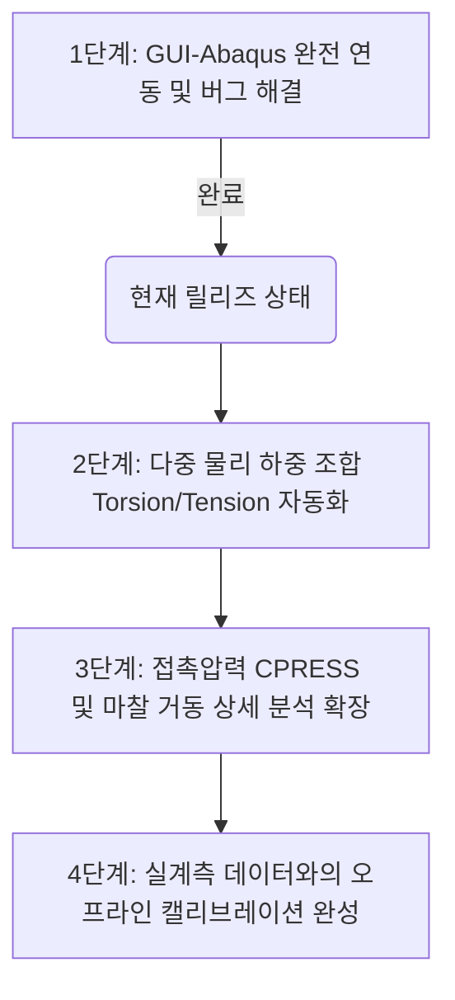

# CURRENT_HANDOFF_KR (현재 인수인계 및 개발 현황)

최종 갱신일: 2026-07-06 KST

## 2026-07-06 Windows/Abaqus Lab PC 업데이트

* **SmallSmoke bridge check 통과**:
  * 최신 검증 폴더: `jobs\SCLAS_jobs\small_smoke_20260706_222907`
  * `result_summary.json.source = SCLAS_ABAQUS_ODB_EXTRACTOR`
  * `odb_extraction.status = extracted`, `rows_written = 25`
* **CurveV0 endpoint sweep 통과**:
  * 최신 parent 폴더: `jobs\SCLAS_jobs\curve_v0_sweep_20260706_223250`
  * factor: `-0.1, -0.05, 0, 0.05, 0.1`
  * parent `result_data.csv`에 5개 data row 생성
  * parent `result_summary.json.source = SCLAS_CURVE_V0_ENDPOINT_SWEEP`
  * `endpoint_sweep_validation.all_child_jobs_validated = true`
  * 5개 child job 모두 `SCLAS_ABAQUS_ODB_EXTRACTOR`, `extracted`, `rows_written = 25`
* **해석 의미 주의사항**:
  * 이번 성공은 GUI-Abaqus bridge와 endpoint sweep 계약 검증이다.
  * reduced smoke 설정은 최종 연구용 contact fidelity를 줄인 검증 모드이므로, 최종 보정 연구곡선으로 보고하지 않는다.

## 📌 1. 저장소 정보 (Repository)

* **GitHub**: `https://github.com/jhpark391-afk/SCLAS-cable-analysis`
* **공동 작업 브랜치**: `main`
* **최종 동기화 커밋**:
  ```text
  837d989 Update SCLAS portfolio contact sheet image to align with latest slide changes
  ```

---

## 🔍 2. 현재 개발 포커스 (Current Focus)

* **GUI-아바쿠스 백엔드 원클릭 해석 연동 성공**:
  * GUI 내부의 `[Run / Create Job]` 버튼 클릭 한 번으로 `input_data.json` 생성 ➔ 아바쿠스 표준 솔버 구동 ➔ 해석 완료 대기 ➔ ODB 데이터 추출 ➔ GUI 그래프 자동 로드까지의 연동 프로세스가 완벽하게 구현 및 실증되었습니다.
* **포트폴리오 및 보고자료 고도화**:
  * 사용자의 지시에 따라, 추가적인 코드 수정이나 해석 물리 모델 확장은 일시적으로 정지하고 **발표용 포트폴리오(PPTX), 요약 이미지(Contact Sheet), 종합 리포트(Walkthrough)** 문서 갱신에 집중하고 있습니다.
* **시스템 검증 합격**:
  * 18가지 스모크 검증을 수행하는 자가 진단 `run_self_check.bat` 상태는 **`PASS`**를 완벽하게 유지하고 있습니다.

---

## 🛠️ 3. 현재 구현 현황 및 주요 해결 과제 (Current Working State)

* **GUI 메인 화면 구동 (`code/sclas_remote_gui.py`)**:
  * PyQt5 기반의 Design / Mesh / Analysis 3단계 워크플로우 탭 구조가 정상 작동합니다.
  * 반응형 윈도우 스크롤바와 Resizable Splitter가 도입되어, 1366x768 해상도에서도 화면 잘림 현상 없이 부드럽게 스크롤됩니다.
* **아바쿠스 Solid-Beam 하이브리드 메쉬 할당 버그 해결**:
  * Sheath 및 Bedding과 같은 3D Solid 요소 영역(Cells)에 1D Beam 요소(`B31`)가 중복 할당되어 아바쿠스가 크래시나던 문제를 해결했습니다.
  * `abaqus_runner.py`의 `elem_code_for_solid` 감지 로직을 추가하여, Solid 영역은 강제적으로 `C3D8R` 요소로 변환하도록 예외 제어 처리를 적용했습니다.
* **Windows 아바쿠스 경로(PATH) 자동 우회 탐색**:
  * 아바쿠스 실행 명령어 환경변수(`PATH`)가 누락된 원격 PC 환경에서도, `abaqus_runner.py`가 시스템 드라이브의 아바쿠스 기본 경로(예: `C:\SIMULIA\Commands`)를 스스로 재귀 탐색하여 `abq2019.bat`를 실행해내는 자동 경로 스캐너를 구축했습니다.
* **SCLAS 퀵 런처 구축**:
  * 루트에 `SCLAS_Quick_Launch/` 바로가기 폴더를 배치하여 터미널 환경이 낯선 비전문가 사용자도 더블클릭으로 GUI 기동 및 시스템 자가 검증을 수행할 수 있도록 하였습니다.
* **오프라인 진단 엔진 (`code/sclas_offline_diagnostics.py`)**:
  * 아바쿠스 해석 중 에러가 날 경우 아바쿠스 원본 로그 파일(`.dat`, `.msg`, `.sta`)을 즉시 분석해, 수렴 실패 원인과 Penalty 튜닝 솔루션을 GUI 화면 요약 창 및 마크다운 리포트로 자동 출력해 주는 인공지능형 진단기를 내장했습니다.

---

## 📈 4. 시스템 검증 결과 및 물리 정합성

* **9포인트 미니 메쉬 연동 실증**:
  * 가벼운 검증 격자 조건(길이 50mm, 아머 4분할 등) 하에서 GUI 런타임 내 해석이 1분 이내에 정상 수동 연산 완료되었으며, ODB에서 추출된 실데이터 기반 모멘트-곡률 선도(`Peak |M|: 0.0233435 kN.m`)를 GUI 화면상에 표출하는 통합 파이프라인의 수동 실증을 완수했습니다.
* **수락 게이트(Acceptance Gate) 적용**:
  * 실제 연구용 데이터로 통과하기 위한 해석 품질 수락 게이트(`curve_v0_continuous_path`, `contact_preload_closure`, `odb_local_fields` 등)를 구축하여, 정밀 해석본의 최종 합격 여부를 판별해 줍니다.

---

## 🗺️ 5. 향후 개발 로드맵 (사용자 대기)

사용자의 후속 오더가 있을 시 즉시 작업에 돌입할 수 있도록 다음의 마일스톤이 계획되어 있습니다:



1. **복합 하중 구속 조건 자동화**: Torsion(비틀림) 및 인장력을 Cyclic Bending(반복 굽힘)과 다중 스텝으로 조합 적용하는 아바쿠스 제어 자동화.
2. **국부 지표 ODB 세부 파싱**: CPRESS(접촉압력), COPEN(접촉이격), CSLIP(마찰슬립량) 등의 미세 국부 필드값을 ODB에서 자동으로 분리 후처리하여 시각화.
