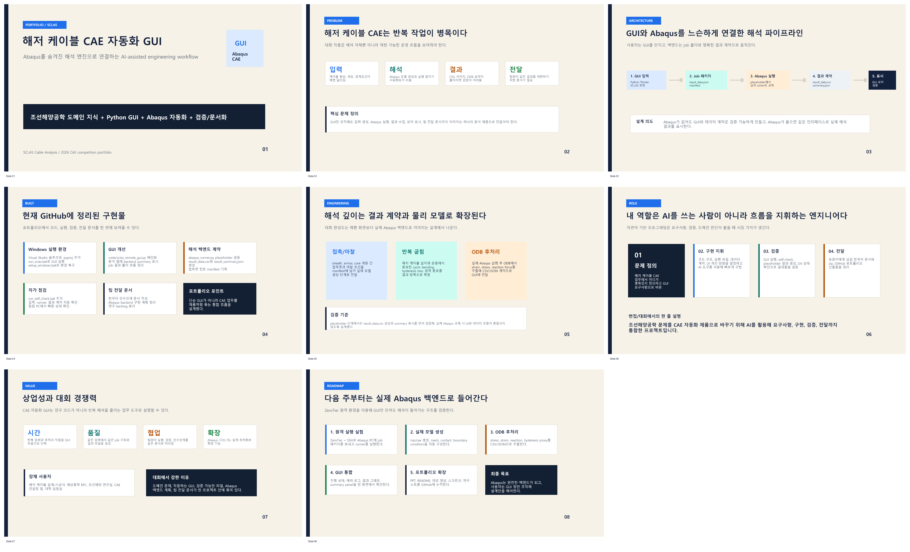

# SCLAS Portfolio

이 폴더는 SCLAS 해저 케이블 CAE 분석 GUI/Abaqus 연동 프로젝트를 포트폴리오 형태로 설명하기 위한 공개 산출물입니다.

## 파일

- `SCLAS_Portfolio_Overview_KR.pptx`: 한국어 포트폴리오 발표 자료
- `SCLAS_Portfolio_Overview_KR_contact_sheet.png`: PPT 전체 슬라이드 미리보기

## 현재 메시지

이 프로젝트는 단순한 Python GUI가 아니라 해저 케이블 CAE 업무를 하나의 분석 제품처럼 묶는 자동화 흐름입니다.

- 사용자는 `run_sclas.bat`로 GUI를 실행합니다.
- GUI는 입력값을 job 폴더와 JSON 계약으로 정리합니다.
- `abaqus_runner.py`는 현재 placeholder 단계에서 CSV/JSON 결과 생성을 검증합니다.
- 다음 단계는 ZeroTier/SSH로 실제 Abaqus PC에 job을 보내고, ODB 후처리 결과를 GUI로 되돌리는 백엔드 통합입니다.

## Preview

