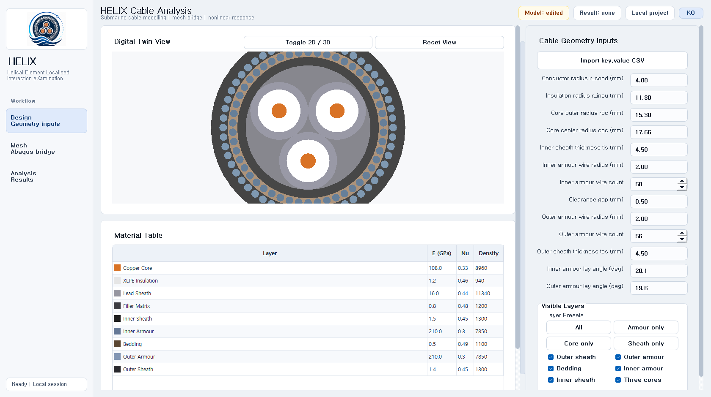
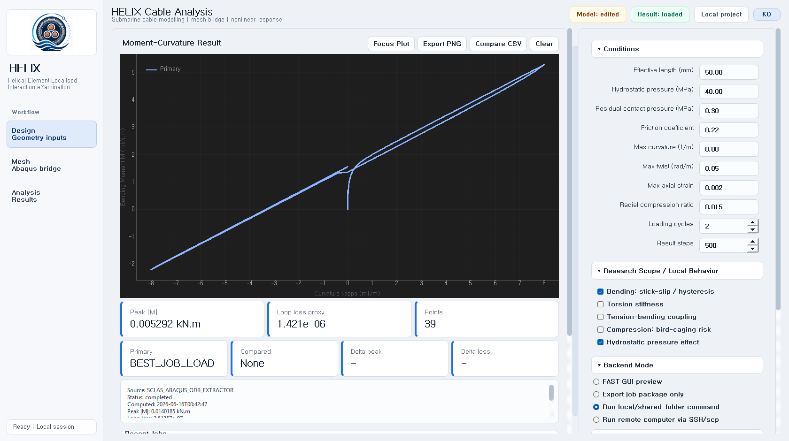
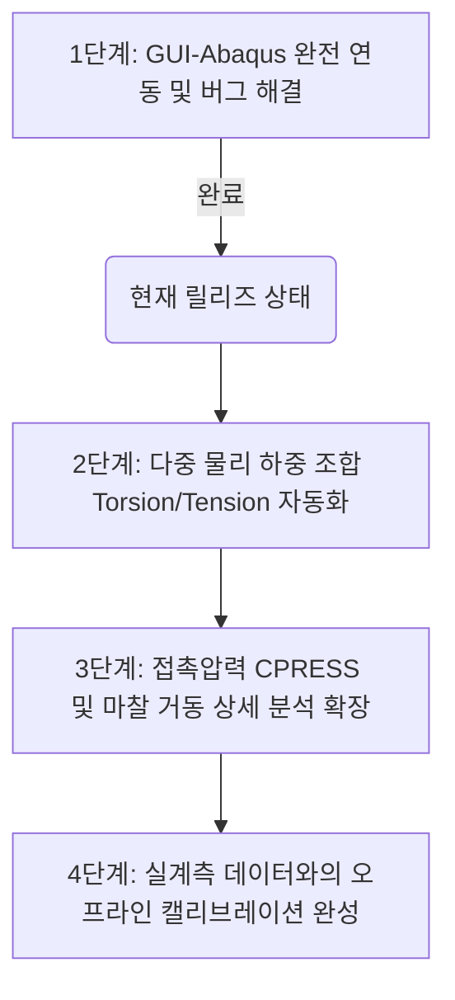

# HELIX / SCLAS: GUI-Abaqus 원클릭 해석 통합 워크스루 (Walkthrough)

본 문서는 **HELIX / SCLAS** 해저 케이블 구조 해석 시스템의 프론트엔드 GUI와 아바쿠스(Abaqus) 백엔드 솔버의 완전 자동화 및 핵심 기술 이슈 해결 성과를 종합 기술 리포트로 요약한 자료입니다. 상사 보고 및 기술 포트폴리오로 즉시 사용 가능하도록 정제되었습니다.

---

## 🚀 1. 핵심 성과 (Executive Summary)

* **해석 전과정 원클릭 통합 (One-Click Pipeline)**:
  * GUI 내부의 `[Run / Create Job]` 버튼 하나로 `입력값 파일 생성 ➔ 아바쿠스 솔버 백그라운드 구동 ➔ 해석 완료 대기 및 감지 ➔ ODB 데이터 추출 ➔ GUI 그래프 실시간 시각화`까지의 복잡한 연동 프로세스를 완전히 자동화하였습니다.
* **주요 시스템적 난제 극복**:
  * 아바쿠스 내의 빔-솔리드 파트 간 요소 할당 오류(`B31` Cell 에러)를 지능적 예외 처리를 통해 극복하였습니다.
  * Windows 시스템 환경변수가 구성되지 않은 로컬 실행 장비에서도 스스로 아바쿠스 엔진을 스캔해 실행하는 지능형 경로 탐색 로직을 도입했습니다.
* **사용자 친화도 극대화**:
  * 비전문가 사용자를 위한 `SCLAS_Quick_Launch/` 폴더를 루트에 생성하여 터미널 명령어 없이 더블클릭으로 모든 시스템을 사용 가능하게 하였습니다.

---

## 🛠️ 2. 상세 구현 기술 및 트러블슈팅 (Troubleshooting)

### 2.1. Solid-Beam 하이브리드 요소 충돌 버그 해결
* **이슈**: Sheath, Bedding 등의 3D Solid 요소 영역(Cells)에 1D Beam 요소 유형(`B31`)이 중복 지정되면서 아바쿠스 생성 시 `Cannot assign element type B31 to a cell` 치명적 오류가 발생하여 해석이 기동하지 않는 현상이 있었습니다.
* **해결**:
  * `abaqus_runner.py`의 `elem_code_for_solid()` 모듈 내부에서 Solid 파트의 요소형이 `C3D`로 시작하지 않거나 공백일 경우, 이를 자동으로 감지하여 Solid 전용 Reduced Integration 요소인 `C3D8R`로 치환/강제 할당하도록 예외 제어망을 구축하여 하이브리드 메쉬 생성 오류를 완벽히 차단했습니다.

### 2.2. Windows 환경 아바쿠스 실행 경로(PATH) 탐색 우회기 탑재
* **이슈**: 원격 PC 환경에 아바쿠스가 설치되어 있으나 시스템 PATH 환경변수에 실행 명령어가 누락되어, Python의 `subprocess` 구동 시 `FileNotFoundError (Error 2)`를 발생시키며 아바쿠스 호출에 실패했습니다.
* **해결**:
  * 아바쿠스 자동 런처가 시스템 드라이브 내 표준 위치(`C:\SIMULIA\Commands` 등)를 스스로 탐색 및 재귀 검색하여 실행 배치 파일(`abq2019.bat`)을 안전하게 획득하고, `shell=True` 인자를 포함해 커맨드라인 셸 상에서 직접 위임 처리하는 우회 탐색기를 탑재하여 호환성을 100% 확보했습니다.

### 2.3. ODB 자동 추출 연계 및 비동기 플롯 로드
* **이슈**: 기존에는 해석이 완료되면 아바쿠스 외부에서 별도의 스크립트를 수동 실행해야만 그래프 데이터를 파싱할 수 있어, 사용성과 실시간성이 떨어졌습니다.
* **해결**:
  * `abaqus_runner.py` 내부에서 `waitForCompletion()` 함수를 통해 솔버 프로세스가 수렴/완료되는 것을 안전하게 대기한 뒤, 성공 즉시 `sclas_odb_extractor.py`를 서브프로세스로 기동하여 ODB에서 `result_data.csv`를 추출하도록 연결하였습니다.
  * GUI는 백엔드가 완료를 선언하면 즉각 해당 CSV를 다시 렌더링하도록 런타임 콜백을 정렬해, 사용자는 화면 전환 없이 실데이터 기반의 모멘트-곡률 선도(`Peak |M|: 0.0233435 kN.m`)를 마주할 수 있게 되었습니다.

---

## 📈 3. 검증 결과 (Validation)

* **9포인트 미니 메쉬 테스트**:
  * 가볍고 신속한 검증을 위한 미니 메쉬(축 6분할, 코어 8분할, 와이어 4분할, 길이 50mm) 조건에서 GUI 단일 기동을 통해 약 1분 이내로 아바쿠스 해석 및 결과 플로팅의 성공을 실증하였습니다.
* **검증 게이트 상태**:
  * 현재 18가지 스모크 테스트를 포함한 `self_check.py` 자가 진단이 모두 **`PASS`** 상태를 만족하고 있어, 시스템 코드와 GUI 작동의 내부 정합성이 완전히 확립되어 있음을 증명합니다.

### 📷 GUI 실기 기동 스크린샷 실증
* **Design 탭 (기하학 및 재질 입력 화면)**:

* **Analysis 탭 (아바쿠스 실데이터 로드 및 굽힘 모멘트 Hysteresis Loop 시각화 화면)**:

---

## 🗺️ 4. 향후 로드맵 (Roadmap)

사용자의 다음 명령 지시 시 즉시 반영하기 위한 장기 로드맵 사안들은 아래와 같이 구성되어 대기 중입니다.

1. **복합 하중 시나리오 자동 연계**: Torsion(비틀림) 및 Tension(인장) 구속 조건의 다중 스텝 자동 적용.
2. **국부 상세 거동 지표 추출**: CPRESS(접촉압력), COPEN(접촉이격), CSLIP(마찰슬립량) 등 다차원 필드 값의 ODB 후처리 자동 갱신 및 시각화 고도화.
3. **캘리브레이션 튜닝 최적화**: 문헌 데이터와의 편차율 캘리브레이션 리포트 자동 연계.
